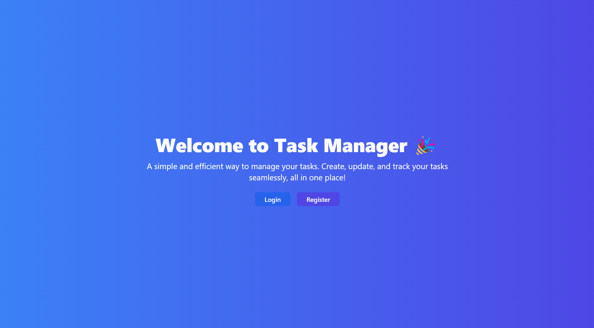
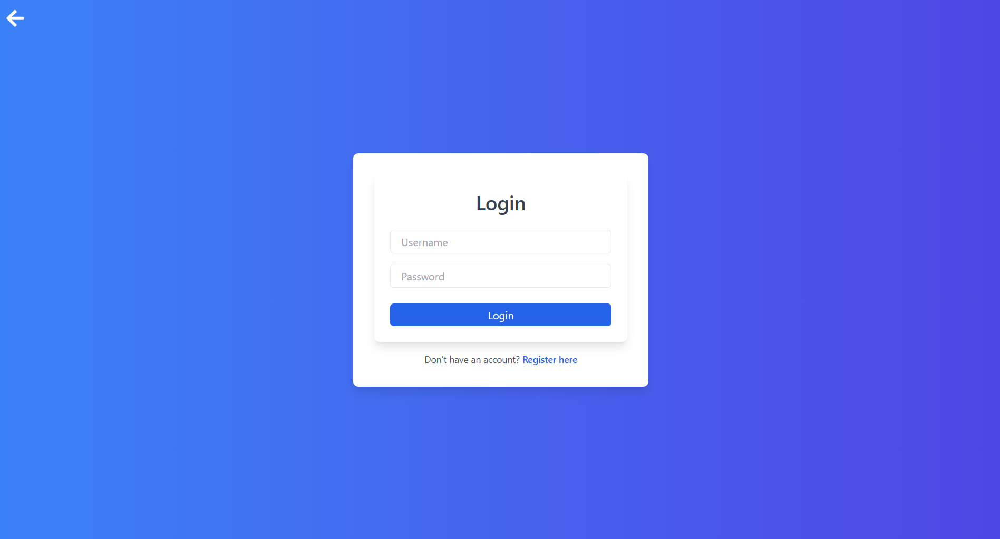
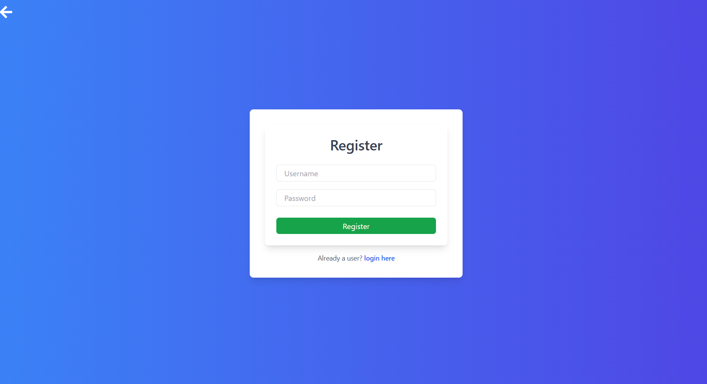
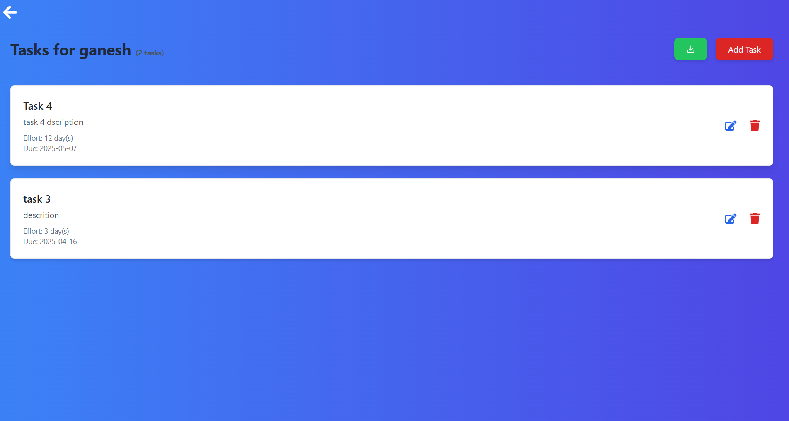
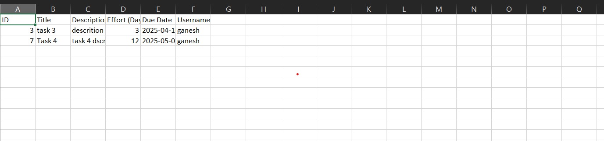

# 📝 Task Manager Fullstack Project

Welcome to the **Task Manager** — a full-stack project that allows users to register, log in, manage their tasks, and export them to Excel!

This project is divided into **three parts**:
- **Backend 1**: Authentication server using **Node.js** and **Express**.
- **Backend 2**: Task management and Excel export server using **Python Django**.
- **Frontend**: Beautiful UI made using **React** and **Tailwind CSS**.

---

## 📸 Project Screenshots

### 1. Home Page


### 2. Login Page


### 3. Register Page


### 4. Task List Page


### 5. Export Tasks to Excel


> All screenshots are placed inside a `screenshots/` folder for easy organization.

---

## 🔥 Project Explanation

This project is organized into three main parts:

### 🛠 Backend 1 - Authentication Server
- Built with **Node.js** and **Express**.
- Handles:
  - User Registration
  - User Login
  - JWT Token generation and verification.
- Users cannot access tasks unless they are authenticated.

### 📚 Backend 2 - Task CRUD Server
- Built with **Python Django**.
- Handles:
  - Create, Read, Update, and Delete (CRUD) operations for tasks.
  - Exporting all tasks into an **Excel (.xlsx)** file.
- Each task is linked to a specific authenticated user.

### 🎨 Frontend - Task Manager UI
- Built with **React** and styled using **Tailwind CSS**.
- Features:
  - Login and Registration Forms.
  - Display list of tasks for logged-in users.
  - Add, Edit, Delete tasks.
  - Export tasks to Excel with one click.
  - Smooth transitions, hover effects, and responsive design.

---

## 🛠 Tech Stack Used

| Layer        | Technologies |
|--------------|--------------|
| Frontend     | React.js, Tailwind CSS |
| Backend 1    | Node.js, Express.js |
| Backend 2    | Python, Django, Django REST Framework |
| Others       | JWT (Authentication), Axios (API Calls), React Router, Excel Export (Django Plugin) |

---

## 🚀 How to Run Locally

1. Clone the repository:
   ```bash
   git clone https://github.com/YourUsername/Task_Manager_Fullstack.git
   ```

2. Navigate to frontend folder:
   ```bash
   cd frontend
   npm install
   npm start
   ```

3. Navigate to Backend 1 (Node.js auth server):
   ```bash
   cd backend-auth
   npm install
   npm run dev
   ```

4. Navigate to Backend 2 (Django task server):
   ```bash
   cd backend-tasks
   pip install -r requirements.txt
   python manage.py runserver
   ```

5. Open your browser:
   ```
   http://localhost:3000
   ```

---

## ✨ Author

Made with ❤️ by Ganesh yadav
